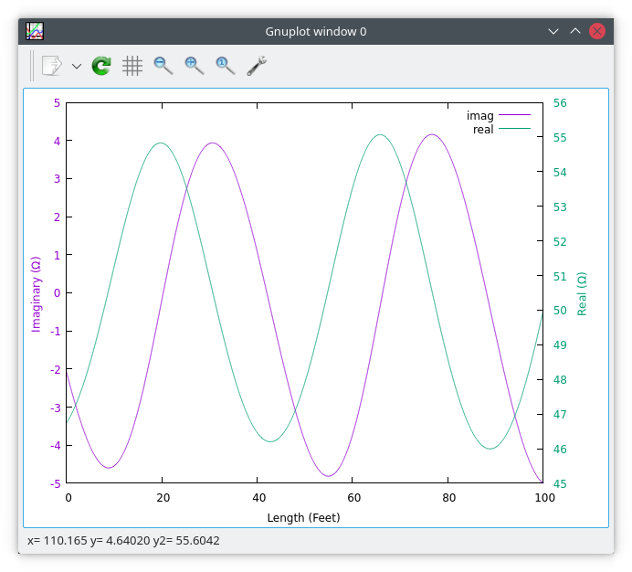
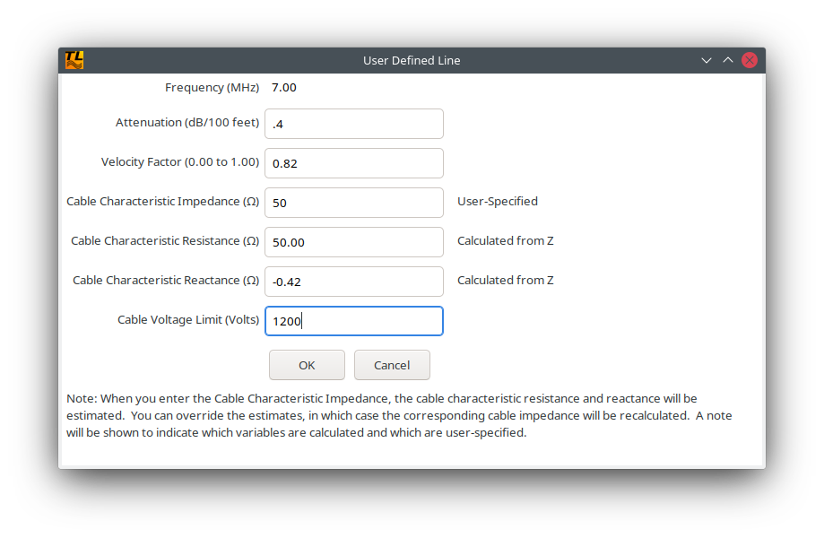

tline - A Transmission Line Calculator for Ham Radio
====================================================

**_tline_** is intended to calculate various transmission line parameters. For example, given a type of cable and a known load impedance, **_tline_** can calculate the impedance at the input of the cable. Similarly, one can specify the input impedance and find the impedance at the far end of the cable.

**_tline_** makes use of gnuplot for visualizing its calculations. Graphs of impedance, voltage, and current along the line can be generated on-screen, and can be saved to files in png, jpeg, and gif formats. The raw data used to make the graphs can also be saved as a text file for post-processing.

**_tline_** uses the wxWidgets library, so while it is being developed on Linux, it can be ported to other operating systems. If you want to help make that happen, please fork the project and create pull requests on github.

Here is a screenshot of the main screen:

Here is a sample graph.  You can see how the impedance varies with length; this happens because the cable and load have different impedances, and hence there are standing waves along the transmission
line:

**_tline_** has parameters for many common transmission lines already built-in.  If you have a transmission line that **_tline_** doesn't provide, you can specify its parameters on this screen:

Please note that all transmission lines have an impedance with both real and imaginary parts, where the imaginary part is capacitive (i.e. a negative number like -j0.2 ohms).  Usually, the imaginary part is small, and cable manufacturers just specify a single number like "50 Ohms".  **_tline_** can estimate the real and imaginary parts of the complex impedance for user-specified lines, or if you have measured the line and know what values you want to use, you can enter them instead.

**_tline_** can help design a matching circuit between a source impedance and a load impedance.  The calculations are based on a Javascript implementation by John Wetherell.  Please follow this [link](http://www.ee.oulu.fi/~timor/javaa/matcher2.html) for his implementation.

Here is a screenshot of the matching calculator:

Note that you must choose a matching network topology that is appropriate for the combination of source and load impedance that you are
trying to match.  **_tline_** will indicate combinations where it is unable to calculate a match.  When this happens, please select a
different network topology.

If you are curious as to the source of the equations that **_tline_** uses to perform its calculations, most of them are taken from the
"ARRL Antenna Book (23rd Edition)".  See also "Reference Data For Radio Engineers (6th Edition)" by ITT.

Finally, a discussion of the equations may be found in the [equations.pdf](doc/equations.pdf) file in the doc directory.

73 de AC2XM

