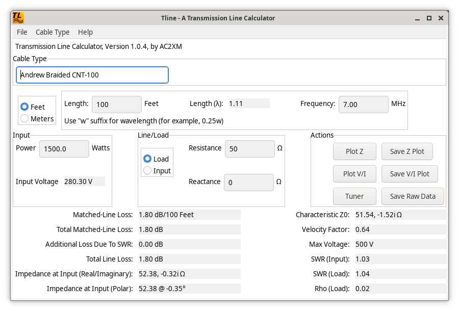

tline - A Transmission Line Calculator for Ham Radio
====================================================

**_tline_** is intended to calculate various transmission line parameters. For example, given a type of cable and a known load impedance, **_tline_** can calculate the impedance at the input of the cable. Similarly, one can specify the input impedance and find the impedance at the far end of the cable.

**_tline_** makes use of gnuplot for visualizing its calculations. Graphs of impedance, voltage, and current along the line can be generated on-screen, and can be saved to files in png, jpeg, and gif formats. The raw data used to make the graphs can also be saved as a text file for post-processing.

**_tline_** uses the wxWidgets library, so while it is being developed on Linux, it can be ported to other operating systems. If you want to help make that happen, please fork the project and create pull requests on github.

Here is a screenshot of the main screen:

Here is a sample graph.  Since we have chosen a 75 Ohm line with a 50 Ohm load, you can see how the impedance varies with length:

If you have a transmission line that **_tline_** doesn't provide, you can specify the parameters on this screen:

Please note that all transmission lines have an impedance with both real and imaginary parts, where the imaginary part is capacitive (i.e. a negative number like -j0.2 ohms).  Usually, the imaginary part is small, and cable manufacturers just specify a single number like "50 Ohms".  **_tline_** can estimate the imaginary part of the complex impedance for user-specified lines, or if you have measured the line and know what value you want to use, you can enter it.

73 de AC2XM

